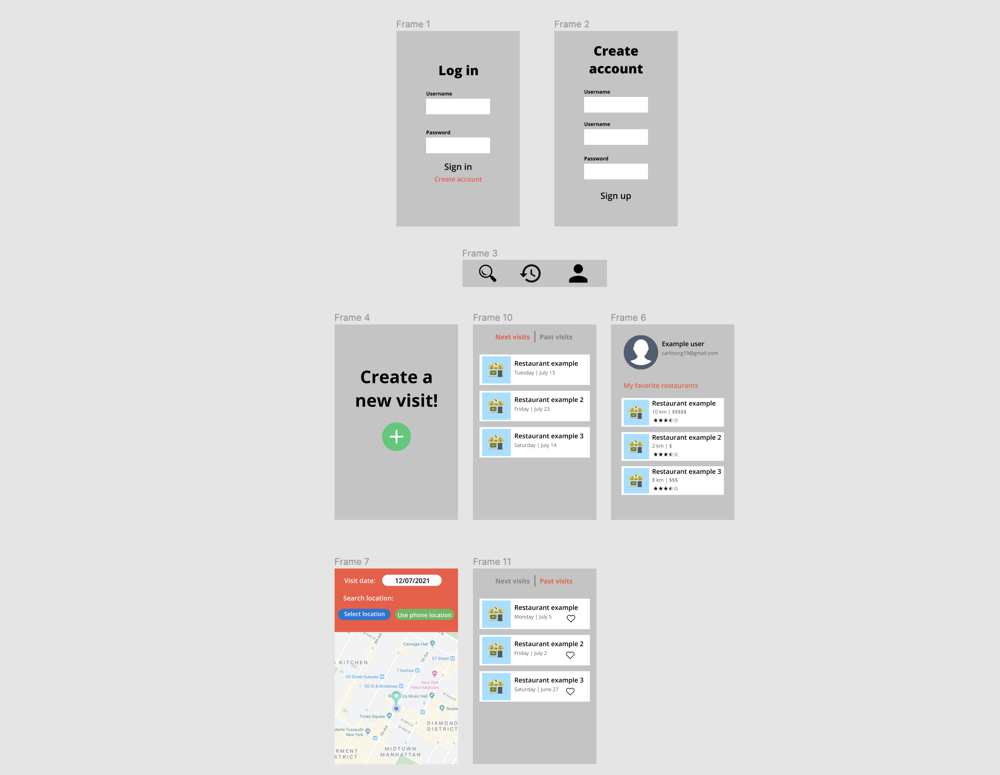
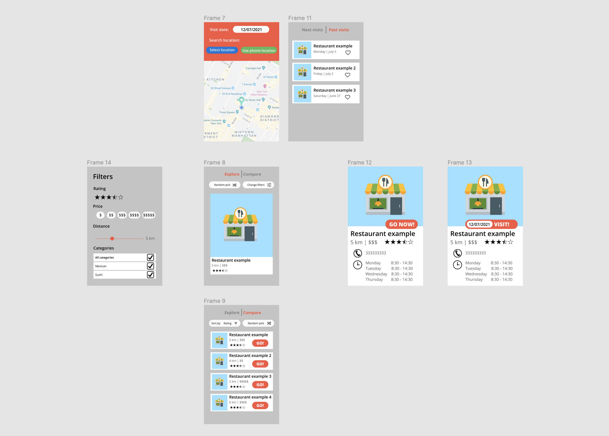

# Feast

## Table of Contents
1. [Overview](#Overview)
1. [Product Spec](#Product-Spec)
1. [Wireframes](#Wireframes)
2. [Schema](#Schema)

## Overview
### Description
An app that gamifies and optimizes the selection process for the best restaurant that meets the criteria specified by the user. The app uses Tinder-like cards to show the different restaurants: the user can see restaurant details, filter the displayed businesses, compare them, like their favorite places and send a visit invite to their friends.

### App Evaluation
- **Category:** travel, food discovery, social
- **Mobile:** mobile first experience
- **Story:** In the main activity, users will see recommendations for restaurants near them and can swipe left to ignore them or right to move them to a next phase of elimination among other selected restaurants.
- **Market:** Tourists, General public (people with access to an smartphone)
- **Habit:** Users can discover new restaurants near them (they can see their information if they swipe up). Users can select and see their favorite restaurants.
- **Scope:** At the beginning, the app is only directed towards exploration by the user, however, it can be expanded to generate partnerships with restaurants to offer coupons or promotions to users who visit them regularly or mark them as favorites. Also, the user could request an Uber through the application to reach the selected place. Finally, a feature can be added to invite friends to a selected restaurant (or even to be able to choose a restaurant among several people).

## Product Spec

### 1. User Stories (Required and Optional)

**Required Must-have Stories**

* [x] User can login and logout.
* [x] User can create a new account
* [x] User can navigate to History and Profile screens, and be able to create a new visit 
* In the visit creation process:
  * [x] User can select location
  * [x] User can select a date
  * [x] User can see a sequence of cards with restaurants near them
  * [x] User can swipe right to select a restaurant (and left to ignore another)
  * [x] User can click a card to see details of an specific restaurant
  * [x] User can filter the displayed restaurants based on characteristics (price, location and categories)
  * [x] User can sort selected restaurants based on Highest Rating, Lowest Prices and Nearest.
  * [x] User can select "Go now!" button to select a restaurant and finish the search
* [x] User can see next visits and past visits (Visits stored in a database)
* [x] User can favorite a restaurant and see it in profile view

**Optional Nice-to-have Stories**

* [x] User can select "random pick" to select a restaurant
* [x] User can create a new visit from detail view
* [x] User can cancel a visit
* [x] A Google Maps route is displayed, which connects the user location with the restaurant location
* [x] User can search for other users and see their favorite restaurants
* [x] User can send friend requests to other users
* [x] User can invite their friends to visits
* [x] User can see notifications on visit and friend request acceptance.
* [x] A push notification is sent when the user receives a visit invitation or a friend request
* [ ] User can edit a visit (invite more friends or change date)    

### 2. Screen Archetypes

* Login
   * [x] User can login into existing account
* Registration Screen
   * [x] User can create new account
* Explore screen
   * User can create a new visit      
         * [x] User can select a date
         * [x] User can select location
   * [x] User can see a sequence of cards with restaurants near them
   * [x] User can swipe right to select a restaurant (and left to ignore another)
   * [x] User can swipe up to see details of restaurants
   * [x] User can only see restaurants that match the specified filters
* Filters screen
   * [x] User can select different characteristics of the restaurants that they want to see in the main stream.
* Detail screen
    * [x] User can see specific information of a restaurant
    * [x] User can select "Go now!" (if they come from Explore screen) or "Create visit!" (if they come from history or profile screen) to instantly create a visit without any steps further
* Compare screen
    * [x] User can choose specific atributes to sort the selected restaurants  
    * [x] User can click on "Go!" button to finally select a restaurant and conclude the process
* History screen
    * [x] User can see next restaurant visits
    * [x] User can see past restaurant visits
    * [x] User can click on any visit to see the restaurant's detail screen
* Profile screen
    * [x] User can see their information (username and email)
    * [x] User can logout
    * [x] User can see favorite restaurants
    * [x] User can click on favorited restaurants to open details for that restaurant 
        
### 3. Navigation

**Tab Navigation** (Tab to Screen)

* Login Screen
* Registration Screen
* Explore Screen
* Filters Screen
* Detail Screen
* History Screen
* Profile Screen
* Compare screen
* Favorites screen

**Flow Navigation** (Screen to Screen)

* Login Screen
   * Explore Screen
* Registration Screen
   * Explore Screen
* Explore Screen
   * Details Screen
   * Filters Screen
   * Compare Screen
* Filters Screen
   * Explore Screen
* Details Screen
   * None 
* Compare screen
   * None
* History Screen
   * Details Screen
* Profile Screen
   * Details Screen 

# Digital Wireframes

_Part 1_

_Part 2_

## Interactive prototype

You can see an interactive navigation prototype of this proyect at:
https://www.figma.com/proto/FATivGVWvbM1oYVIUHpsfT/Untitled?node-id=7%3A83&scaling=min-zoom&page-id=0%3A1&starting-point-node-id=3%3A30

# Schemas 

### Model: Restaurant

| Property | Type | Description |
| --- | --- | --- |
| objectID | String | Unique identifier for the Restaurant (default field) |
| name | String | Name of this business. | 
| imageUrl | String | URL of photo for this business. | 
| telephone | String | Phone number of the business | 
| rating | float | Rating for this business (value ranges from 1, 1.5, ... 4.5, 5). | 
| price | String | Price level of the business. Value is one of $, $$, $$$ and $$$$. |  
| categories | Array | list of strings that represent the categories that the restaurant match | 
| city | String | Represents the city in which the business is located | 
| country | String | Represents the country in which the business is located | 
| coordLatitude | float | Latitude coordinate of the restaurant's location | 
| coordLongitude | float | Longitude coordinate of the restaurant's location | 
| yelpId | String | Identifier for restaurant in Yelp's API | 

### Model: User

| Property | Type | Description |
| --- | --- | --- |
| objectID | String | unique identifier for the Restaurant (default field) |
| createdAt | DateTime | date when user is created |
| username | String | name of the user |
| email | String | user's email |
| password | String | user's password |
| profileImage | File | user's profile picture |
| firstName | String | user's first name |
| lastName | String | user's last name |
| description | String | user's simple description of their person and their likes |

### Model: Visit

| Property | Type | Description |
| --- | --- | --- |
| objectID | String | unique identifier for the Restaurant (default field) |
| createdAt | DateTime | date when visit is created |
| user | Pointer to User | user that liked the restaurant |
| restaurant | Pointer to Restaurant | restaurant that has been selected |
| date | Date | Date object that indicates when the visit is going to happen |
| dateStr | String | Date in string format so it is ready to be displayed to the user's screen |
| attendess | Array | Array of pointers to User objects representing the users that will attend the visit |

### Model: Like

| Property | Type | Description |
| --- | --- | --- |
| objectID | String | Unique identifier for the Restaurant (default field) |
| createdAt | DateTime | date when like is created |
| user | Pointer to User | User that liked the restaurant
| restaurant | Pointer to Restaurant | reference to Restaurant object that this like belongs to |

### Model: Hour

| Property | Type | Description |
| --- | --- | --- |
| objectID | String | Unique identifier for the location (default field) |
| day | int | From 0 to 6, representing day of the week from Monday to Sunday. Notice that you may get the same day of the week more than once if the business has more than one opening time slots. | 
| open | String | Start of the opening hours in a day, in 24-hour clock notation, like 1000 means 10 AM. | 
| end | String | End of the opening hours in a day, in 24-hour clock notation, like 2130 means 9:30 PM. | 
| restaurant | Pointer to Restaurant | Reference to restaurant object for this hour | 

### Model: VisitInvitation

| Property | Type | Description |
| --- | --- | --- |
| objectID | String | Unique identifier for the location (default field) |
| visit | Pointer to Visit | Visit related to this invitation | 
| fromUser | Pointer to User | User that created the visit invitation | 
| toUser | Pointer to User | User that is being invited to visit | 
| status | String | current state of the invitation, can be "pending", "accepted" or "declined" | 

### Model: FriendRequest

| Property | Type | Description |
| --- | --- | --- |
| objectID | String | Unique identifier for the location (default field) |
| fromUser | Pointer to User | User that sent friend request | 
| toUser | Pointer to User | User that received friend request | 
| status | String | current state of the request, can be "pending", "accepted" or "declined" | 

# Networking

## Parse Network Requests

* History Screen
  * (Read/GET) Query next visits 
  * (Read/GET) Query past visits
  * (Read/GET) Query visit invites
  * (Delete) Delete existing visit
* Profile Screen
  * (Read/GET) Query user object
  * (Read/GET) Query businesses liked by the user
  * (Create/POST) Send friend request
  * (Update/PUT) Update user profile images
* Notifications Screen
  * (Read/GET) Query visit invitations results
  * (Read/GET) Query friend request results
  * (Update/PUT) Answer to friend requests
* Details Screen 
  * (Read/GET) Query business object 
  * (Read/GET) Query if like for that object exists
  * (Create/POST) Create a new visit from details screen 

# Sprints walkthroughs

## Sprint 1 (July 12th - July 16th)

* User can go to create screen
  * User can select a date
  * User can select a location using Places API
  * User can see restaurants near them 
  * Restaurants are displayed using Tinder-like cards, can swipe to left or right
* User can go to filters screen and apply filters to specify the criteria for restaurant
* User can go to compare screen and see the restaurants that were swiped to the left
* Next visits and past visits are displayed on History screen
* User can like restaurants on past visits
* User can login
* User can logout
* User can see their favorite restaurants 

## Sprint 2 (July 19th - July 23th)

* User can search for other users 
  * User can see other users liked restaurant
* User can go to details screen and see other important info about the restaurant
* User can like restaurants in Details Screen
* User can send friend requests
* User can answer friend requests on Notifications Screen
* User can see Visit Invitations or Friend Requests results on notifications screen
* User can see invitations in Next Visits

## Sprint 3 (July 26th - July 30th)

* Complete UI redesign
* User can cancel a visit
* User can edit profile picture
* Fixed various bugs 

You can find a walkthrough here! : https://imgur.com/a/UABXGIa
